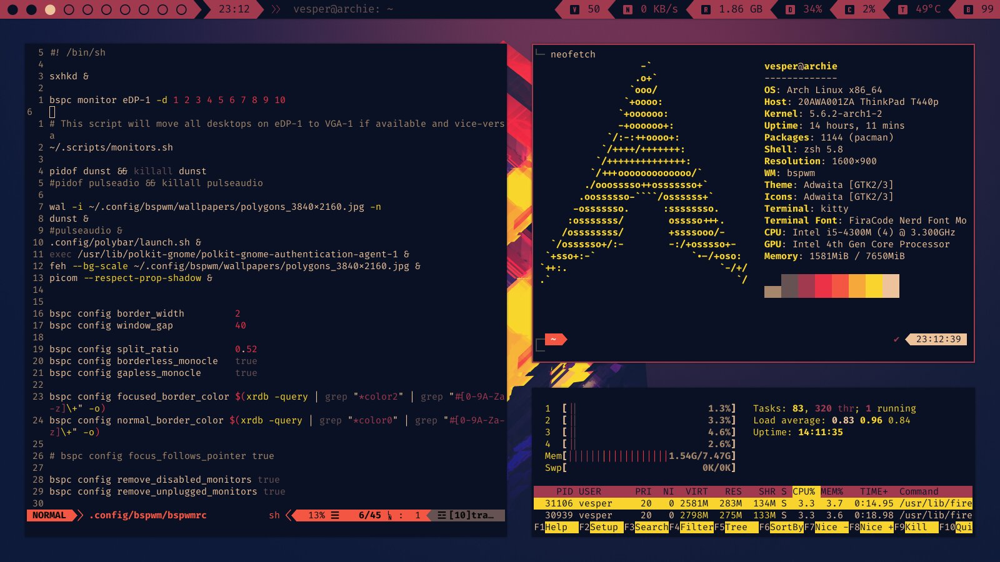

These are my configuration files, it's as simple as that

# Screenshot

# How to install
Simply install a package called "stow", clone this repo, remove README file and execute the command `stow * -t ~` inside of it
This should create symlinks in your `.config` folder which points to corresponding folders in the dotfiles repo.

**NOTE:** Once you've cloned this repo, you can move it anywhere you want, but after executing the `stow` command inside of it
if you move it you'll mave to execute `stow * -t ~` inside of it again to update it's location.

## Extra
I learned about stow from Wolfgang on this video `stow`, [https://www.youtube.com/watch?v=MJBVA4LeJKA](https://www.youtube.com/watch?v=MJBVA4LeJKA)

# Notes for myself
## Install php lang server for neovim
`composer global require felixfbecker/language-server`

`composer run-script --working-dir=~/.config/composer/vendor/felixfbecker/language-server parse-stubs`
